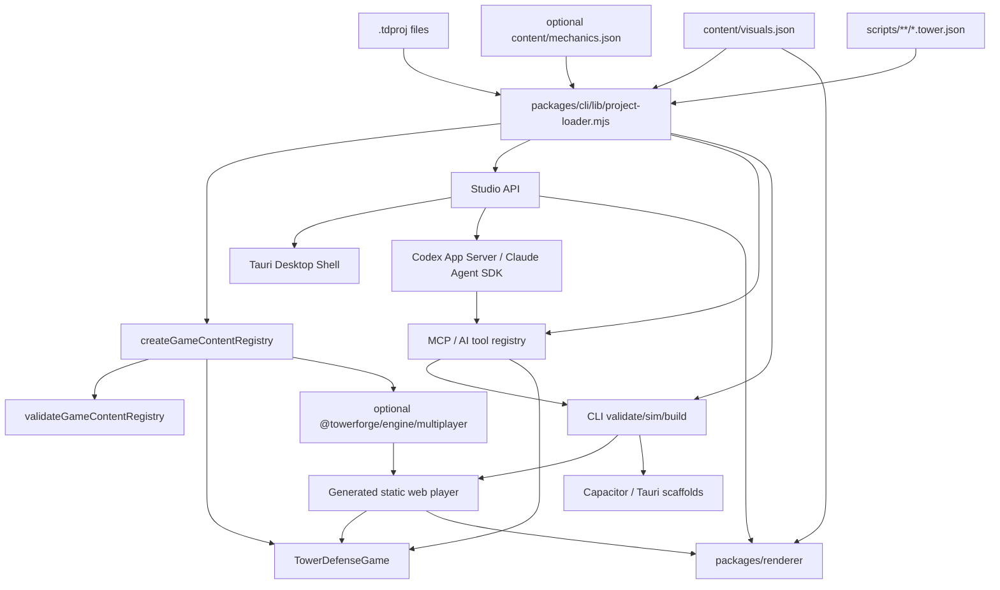

# Architecture

## System Overview

TowerForge has project data, a pure engine core, and adapter layers around it:

```text
.tdproj project data
  -> Node project loader / schema normalization
  -> @towerforge/engine content registry
  -> deterministic headless simulation
  -> CLI, Studio, MCP/AI tools, renderer, generated player, and packaging adapters
```

The engine owns tower-defense rules. The CLI, Studio, and MCP tools own project loading, migrations, filesystem operations, validation UX, source map compilation, asset copying, build output, native scaffolding, and local serving. The renderer owns browser drawing over snapshots and map definitions. The generated web player imports the compiled engine, renderer, and project data.

## Module Boundaries

| Area | Owns | May Depend On | Must Not Depend On |
| --- | --- | --- | --- |
| `packages/engine/src/simulation` | Deterministic gameplay state, tower/enemy mechanics, TowerScript execution, actions, snapshots | `packages/engine/src/content` types, simulation and scripting helpers | DOM, Node, filesystem, Studio, CLI, browser APIs |
| `packages/engine/src/scripting` | Versioned TowerScript types, expression evaluation, validation, and runtime limits | serializable simulation/content types | JavaScript evaluation, DOM, Node, filesystem, network, renderer APIs |
| `packages/engine/src/content` | `GameContentRegistry`, project content validation, runtime content contracts | simulation types and map helpers | Studio UI, CLI filesystem code |
| `packages/engine/src/generation` | Pure seeded procedural candidates and evidence over engine topology | browser-safe RNG and topology helpers | Prompt providers, workers, Node, filesystem, Studio, network |
| `packages/engine/src/multiplayer` | Fixed-tick match sessions, ownership/envelopes, checksums/replay, handshake, reconnect/desync, and transport contracts | engine content/simulation plus injected transport ports | Node, filesystem, hosted identity/lobbies/matchmaking, constructed sockets |
| `packages/cli` | `.tdproj` loading, normalization, engine compilation, validate/sim/build/create commands | compiled engine, Node standard library | Browser DOM, Studio UI state |
| `packages/studio` | Local editor server, browser UI, direct AI adapters, and account-runtime bridge | CLI project loader, shared tool registry, official Codex/Claude runtimes, Node standard library, project files | Direct gameplay rule reimplementation, OAuth credential parsing, arbitrary agent shell/filesystem access |
| `packages/desktop` | Tauri shell, native menus/window lifecycle, packaged Studio runtime, bundled Node/Codex/Claude runtimes, desktop installers | Studio command bridge, Studio server, CLI/MCP/renderer runtime files, Tauri/Rust shell code | Gameplay rules, project schema forks, renderer-specific gameplay behavior |
| `packages/mcp` | Transport-agnostic constructor tool registry plus stdio MCP server | CLI project loader, map compiler, packaging helpers, validation | Gameplay rules outside engine APIs, broad unvalidated filesystem writes |
| `plugins/towerforge` | Canonical Codex plugin source bundle and generated local MCP runtime | Versioned copies of MCP/CLI/engine/renderer runtime files | Cloud backend, credentials, arbitrary workspace discovery, source-only build dependencies |
| `packages/renderer` | Browser Canvas rendering, pure shared presentation projections, and the bounded Procedural Juice planner/adapters consumed by Canvas and Phaser | Browser canvas/Web Audio APIs at adapter edges, serializable snapshots/content data | Gameplay rules, mechanics profiles, engine mutation, Node, filesystem, Studio server |
| `packages/player-runtime` | Renderer-neutral browser profile persistence adapter and exact app-scoped storage-key contract | Injected Storage-like port, compiled engine profile codec/content | Browser globals, DOM, Node, gameplay/profile rule duplication, renderer internals |
| `examples/*.tdproj` | Example source projects | documented `.tdproj` schema | Generated build artifacts as source |

## Layering Rules

Allowed dependency direction:

`engine types/helpers -> engine content -> engine simulation/generation/multiplayer -> cli/studio/mcp/player adapters`

Renderer and player runtime are sibling adapters. The renderer consumes serializable snapshots and project visual data; `packages/player-runtime` consumes the engine-owned profile codec through dependency injection and a caller-supplied Storage-like port. Neither adapter owns gameplay/profile rules or imports Node/filesystem code.

Studio, CLI, and MCP MAY share Node project-loader code. Engine MUST remain importable as compiled browser-safe ES modules.

## Data Flow



## Project Format

`.tdproj` is a directory, not a binary file. Source files are stable JSON and should remain git-friendly:

- `project.json`
- `content/balance.json`
- `content/mechanics.json` (optional, versioned opt-in mechanics catalog)
- `content/world-map.json`
- `content/visuals.json`
- `content/story-comics.json`
- `content/battle-backgrounds.json`
- `maps/src/*.tmj`
- `maps/compiled/maps.json`
- `scripts/**/*.tower.json`
- `build-targets.json`

`.towerforge/` is local working state for backups/session files and MUST NOT be committed. R6 Visual Graph layouts live below `.towerforge/towerscript-layouts/`; R7 completed auto-balancer evidence may be cached below `.towerforge/cache/auto-balancer/v1`; R10 completed Persona QA evidence may be cached below `.towerforge/cache/persona-qa/v1`; and generated media remains private below `.towerforge/generated-assets` until explicit commit. These authoring records do not participate in gameplay/content hashes and are excluded from builds, players, project packs, and `.tdpack` output.

`content/mechanics.json` is deliberately absent from legacy projects and ordinary starter templates. When present, it contains independent versioned module profiles; `mission.mechanics.profiles` selects them per mission. The engine resolves that authored selection into a read-only `CapabilitySet` and is the only authority that may report a module as available. A catalog entry, `enabled: true`, and a valid mission selection are all required before a capability may become active.

Project schema v3 is an explicit mechanics-authoring boundary: a project that authors `content/mechanics.json` MUST declare v3, while v0/v1 migrations and unchanged v2 projects remain v2. Loading, saving, building, packaging, or reading capabilities MUST NOT synthesize the optional file or silently upgrade the manifest.

### Independent version domains

| Domain | Current/first contract | Compatibility rule |
| --- | --- | --- |
| `.tdproj` manifest | v3 when mechanics are authored | Legacy projects without the optional file remain v2 |
| Visual catalog and procedural presentation | visuals v2 legacy; visuals v3 with optional `proceduralJuice` v1; `tf-juice-rng-v1` | First R11 authoring explicitly promotes the project manifest and visuals document to v3; missing block keeps legacy renderer/audio behavior and snapshot bytes; future inner versions are lossless/read-only and fail closed; presentation data never enters gameplay digests/checkpoints/replays |
| Mechanics catalog and modules | catalog v1; `combat` v1/v2/v3; `reactions`, `navigation`, `physics`, `terraforming`, `director`, `quests`, and `enemyBehaviors` v1; `logistics` v1/v2/v3; `heroes` v1/v2/v3/v4/v5/v6/v7; `elevation` v1/v2/v3; `roguelite` v1/v2/v3/v4; `multiplayer` v1/v2 | Reactions depend on the same mission's active combat v2/v3 profile; elevation v2 adds optional LoS and v3 high-ground rules; roguelite v2 adds optional artifact loot/socket state, v3 independently permits optional artifacts and deterministic wave draft, and v4 adds an independent optional campaign marker while preserving v3 battle behavior; heroes evolve monotonically from static roster through movement, durability, active ability, nullable battle-local skill tree, independently nullable passive tower-damage aura, and nullable dynamic blocking; only active non-null blocking depends on the same mission's explicitly selected Dynamic Navigation profile; logistics v1 independently adds nullable deterministic power, v2 adds finite local ammunition, and v3 adds independently nullable bounded production/storage/transfer; Director v1 only selects from its authored counter pool; quests v1 selects battle-local secondary objectives only for the mission's active supported profile; enemyBehaviors v1 adds targetable boss components and tower routing only to the active mission; multiplayer v1 is local co-op and v2 is an explicit asymmetric Send-vs-Build profile; null/legacy paths do not activate adjacent mechanics, component state, quests, or multiplayer packaging; unsupported future versions fail closed and upgrades are explicit |
| Player profile | engine-owned canonical `PlayerProfileV3` codec with explicit v2 migration | Profile migration never follows project migration implicitly; `CampaignRun` remains a separate version domain and browser persistence delegates to the codec |
| Campaign run | engine-owned `CampaignRunV1` codec plus optional content-aware R4.4 coordinator; campaign graph v1/v2; campaign marker v1/v2 | Canonical run bytes stay version 1 and separate from profile/checkpoint; graph v2 adds structural choices, while marker v2 alone enables deterministic deck/artifact battle handoff and atomic settlement |
| Engine checkpoint | `GameCheckpointV1`; `towerforge-sim-v2` | Closed codec and engine/content/RNG/state digests gate atomic restore; active terraforming uses exact inner schema v2 for elevation overrides/timed groups; Logistics v2 ammunition uses inner schema v1 and Logistics v3 ammunition/supply uses inner schema v2; active quests and enemyBehaviors each use an exact optional inner schema v1 snapshot-form section, without changing the outer version |
| Command and journal | `GameCommandV1…V6`; `GameCommandJournalV1…V6` | Earlier forms remain byte-compatible; artifact sockets use v2, draft choice v3, hero movement v4, hero ability v5, and battle-local skill unlock v6; blocking adds no command or journal bump, and all journal versions remain closed validation-only codecs that reference a checkpoint rather than living inside checkpoints/projects |
| Deterministic replay | `replayGameCommandJournal`; engine contract in R0C.6 | Validates the complete journal before restore, executes parsed commands once, then checks each normalized result before its post-state digest |
| TowerScript and authoring/debug documents | TowerScript v7; Behavior Tree/HFSM v1; trace v2; debugger/cursor v2; graph v2; local layout v1 | Schema v7 controllers are script-local opt-ins and require no mechanics catalog. Active HFSM alone adds optional checkpoint `scriptMachines` inner v1; project v3, outer checkpoint/engine, command/journal v6, profile, campaign, mechanics, renderer/player, and multiplayer versions remain independent. TowerScript v1-v6 preserve their prior path |
| Generative authoring | `MapGenerationSpecV1`; staged asset metadata v1; auto-balancer result/cache v1 | Compute/staging results are not gameplay state; balance/map/media commit through independent reviewed transactions |
| Persona QA authoring | request/report v1; worker/cache envelope v1 | Compute-only fixed policies issue existing `GameCommandV6`; completed evidence is cached by content, engine, and request identity, while cancellation produces no cache entry or partial findings |
| Multiplayer protocol | protocol v1; local/asymmetric journals v1; offline challenge/reconnect/transport v1 | Player/sequence/tick metadata remains outside `GameCommand`; handshake rejects incompatible protocol, engine, content, mode, or capability identity |

These domains MUST evolve independently. A project schema bump MUST NOT rewrite profiles, checkpoints, replays, or network envelopes by implication.

## Cross-Cutting Concerns

- Validation: `validateGameContentRegistry` is canonical for cross-reference and numeric guards.
- Opt-in mechanics: `packages/engine/src/content/mechanics.ts` owns stable module IDs and capability resolution. The loader may structurally normalize catalogs, but Studio, MCP, renderers, and generated players MUST consume the engine result rather than infer availability or gameplay rules.
- Advanced enemy behaviors: `enemyBehaviors` v1 is a mission-selected opt-in profile. The engine alone owns component routing, component shield/HP mutation, typed ability suppression, cleanup, and active-only snapshot/checkpoint state. Studio and MCP author through the existing guarded mechanics transaction; Canvas and Phaser consume one fail-closed component presentation projection. No component state or work exists on the absent/disabled/unselected path. See [ADR 0053](docs/adr/0053-r12-advanced-enemy-behaviors.md).
- Simulation: `TowerDefenseGame` is canonical for gameplay behavior; CLI and Studio must call engine APIs instead of duplicating rules.
- TowerScript DX 2.0: R6 is an explicit authoring/debug capability, not a mission mechanics module. `packages/engine/src/scripting/trace.ts` owns the bounded detached trace chain `event -> binding -> handler -> condition -> action -> state_diff/diagnostic`; no collector means the ordinary runtime retains no trace. `packages/engine/src/simulation/towerscript-debugger.ts` wraps the existing journal/checkpoint/runtime for `tick | event | handler | action` inspection and bounded tick rewind. Every historical inspection frame replays the target command from its validated pre-checkpoint and never replaces the live game with a partial frame. `packages/engine/src/scripting/graph.ts` losslessly projects the canonical TowerScript AST; unknown future actions remain raw nodes instead of being guessed or discarded. Completion, palette, known-node property forms, and help data come from `TOWER_SCRIPT_SCHEMA`, not client-owned allowlists. MCP exposes the same bounded debug path through compute-only `preview_tower_script_trace`; graph writes remain granular preview/apply transactions. See [ADR 0047](docs/adr/0047-towerscript-dx-2.md).
- TowerScript DX 3.0: R9 extends that opt-in boundary only for TowerScript schema v7. `packages/engine/src/scripting/behavior-tree.ts` evaluates bounded synchronous `selector | sequence | condition | action` target controllers after canonical alive/class/range/LoS eligibility; failure or budget exhaustion falls back to the saved target mode, and failed branches transactionally restore their incoming selection. `packages/engine/src/scripting/state-machine.ts` resolves ordered hierarchical transitions from active leaf to ancestors, commits the absolute target state before the common exit/transition/entry action phases, and records active-only HFSM state in optional checkpoint `scriptMachines` inner v1. Graph, trace, and debugger independently advance to v2 with behavior/transition nodes, provenance, and step modes; layout remains v1 and the canonical AST stays the only gameplay source. The Studio-only `towerscript-layout.mjs` walks Graph containment edges in deterministic authored order, preserves stable-ID pinned layout-v1 records and places only missing cards without overlap; it has no gameplay or engine dependency. Studio, renderers, players, and MCP consume engine descriptors/snapshots and do not own targeting or transition rules. The guarded JSON/Graph workflow and compute-only trace remain unchanged. R9 is accepted after all gates and both independent sign-offs passed without open P0-P2; see accepted [ADR 0050](docs/adr/0050-towerscript-dx-3-behavior-hfsm.md) and the opt-in fixture in `docs/examples/opt-in-towerscript-dx3/`.
- Director and generative authoring: `director` v1 evaluates only authored counters against engine-owned defense analysis. Eligibility is bounded by threat/fairness and deterministic order is priority, matched-condition severity, then binary ID; source waves are immutable and the optional snapshot/event is authoritative for presentation. The pure map generator accepts only `MapGenerationSpecV1`; Node workers own cancellable seed/strategy balance batches and content+engine cache identity. Generated image bytes remain behind opaque staged handles until MIME/signature/size/license/provenance and revision-guarded import succeed. Balance proposals, map previews, and media staging never auto-commit or share a transaction. See [ADR 0048](docs/adr/0048-opt-in-director-and-generative-studio.md).
- Persona QA and procedural quests: `packages/engine/src/simulation/persona-qa.ts` owns the pure fixed-policy mission × seed × persona runner, canonical request ordering, detached evidence, replay proof, a 65,536-cell selected-map ceiling, and hard run/tick budgets. `packages/cli/lib/persona-qa-worker.mjs` owns the bounded cancellable Node worker pool and private completed-result cache under `.towerforge/cache/persona-qa/v1`; every worker rechecks content/engine identity before accepting work, cached reports are validated against the exact Cartesian request, corrupt/future entries are ignored, and cancellation emits neither partial findings nor a cache entry. The public `persona-qa` CLI command, read-only Studio QA Lab, and compute-only MCP tool all reuse this boundary and have no apply/auto-fix path. Separately, the mission-selected `quests` v1 mechanics module owns deterministic weighted selection and battle-local `kill_with_source` or `preserve_shield` progress. Studio authoring reuses the existing revision-guarded mechanics transaction; MCP exposes the same descriptor/recipe/preview flow; Canvas, Phaser, Playtest and generated packages consume the shared active-only quest projector. Only an active supported profile adds `snapshot.quests`, checkpoint `state.quests`, `questCompleted`, or `questFailed`; restore recomputes and validates the expected selection from the original RNG identity and mission. Shield preservation fails only on an eligible tower/hero shield crossing from positive to zero; partial loss and enemy shields do not fail it. Quests do not alter primary victory/defeat, issue commands, grant rewards, or persist to profile/campaign/multiplayer. See [ADR 0051](docs/adr/0051-r10-persona-qa-and-procedural-quests.md).
- Multiplayer: `packages/engine/src/multiplayer` is a separate browser-safe entrypoint over existing simulation commands/checkpoints/digests. Local co-op owns one fixed-tick game; schema v2 asymmetric mode owns two lanes, routes ordinary `GameCommand` actions only to the issuing player's lane, and atomically applies authored `sendEnemy` cost/income/spawn to the linked opponent lane. The session remains the only tick owner. Protocol envelopes own player identity, per-player order, authoritative match-wide `matchSequence`, and apply tick; both sequence domains fail closed before mutation, so transport arrival order cannot select simulation order. Journals and offline challenges own checksummed replay, reconnect verifies checkpoint against accepted journal, and diagnostics only report divergence. In-memory transport and the injected WebSocket-like adapter carry detached bounded frames without owning simulation. Generated players import this entrypoint only for an active selected multiplayer profile. Hosted identity, auth, lobby, matchmaking, NAT traversal, and a mandatory relay remain outside the engine and R8. See [ADR 0049](docs/adr/0049-opt-in-multiplayer-protocol.md).
- Damage and modifiers: `packages/engine/src/simulation/modifiers.ts` owns the bounded data-only modifier order, and `damage.ts` owns the stateless `DamagePacket`/`DamageResolver` pipeline. `TowerDefenseGame.resolveAndApplyDamage` is the single private resolver/HP-mutation boundary for tower hits, abilities, TowerScript, status/DoT, enemy attacks, and core leaks; before resolution or mutation it fails closed unless the packet target kind and exact enemy/tower id and type match the mutable target. Packet wrappers, events, death, and rewards remain in the game runtime. A leaked enemy's `hp = 0` is a removal marker, not a damage bypass. R1.1 preserves every public schema and legacy result. See [ADR 0017](docs/adr/0017-damage-routing-equivalence.md).
- Combat shields: `combat` v1 is a closed opt-in shield catalog for enemy types and destructible tower types. The engine applies an active runtime shield after resolution/resistance and before HP, owns regeneration and typed change events, and serializes state through snapshots/checkpoints. TowerScript v3 can observe and restore existing shields but cannot create them. See [ADR 0018](docs/adr/0018-opt-in-combat-shields.md).
- Combat armor and marks: `combat` v2 retains shields and adds author-defined `damageTypes`, `armorTypes`, and enemy-only `armorAssignments`; v3 adds enemy-only mark definitions and source bindings. Primary damage uses `source modifiers -> marks -> armor matrix -> entity resistance -> legacy pierce_only -> shield -> HP`. Armor remains stateless; live mark stacks/duration use combat-state schema v2 and deterministic checkpoint/replay. `armor_piercing` bypasses only the legacy adapter. See [ADR 0019](docs/adr/0019-opt-in-armor-matrix.md) and [ADR 0020](docs/adr/0020-opt-in-vulnerability-marks.md).
- Elemental reactions: the independent `reactions` v1 module owns bounded exposures, directional AND-predicate rules, consumption, and secondary damage plans. It requires an active combat v2/v3 profile for each selected mission. Eligible direct enemy hits complete the primary pipeline first; reaction damage then re-enters the same resolver and death/reward settlement remains exactly once. Synchronous FIFO execution is capped at depth 4 and 256 secondary packets per root. Exposure state uses optional top-level reactions-state schema v1; pending work is never checkpointed. See [ADR 0021](docs/adr/0021-opt-in-elemental-reactions.md).
- Authored elevation: R3.1 adds sparse signed `GridMapDefinition.elevationOverrides` with implicit zero and a closed empty `elevation` v1 mission profile. R3.2 extends the module monotonically to v2 with optional deterministic LoS, and R3.3 extends it to v3 with an independent bounded `highGround` sibling; topology, acquisition, LoS, and damage rules stay in the engine. Authored values remain the immutable base. Accepted R3.4b C3A may layer sparse persistent runtime values over that base only when both the mission's elevation profile and the terraforming profile's elevation policy are active. Accepted C3B may temporarily replace that effective value while retaining the exact persistent/authored before-image. `GridMap.elevationAt`, `snapshot.elevation`, LoS, and high-ground read the effective value; reset removes the runtime layer. The active inner checkpoint section preserves runtime elevation and any timed ownership, while inactive/disabled/unselected projects retain the earlier byte shape. See [ADR 0023](docs/adr/0023-opt-in-authored-elevation-foundation.md), [ADR 0024](docs/adr/0024-opt-in-deterministic-elevation-line-of-sight.md), [ADR 0025](docs/adr/0025-opt-in-authored-high-ground-modifiers.md), and [ADR 0027](docs/adr/0027-opt-in-transactional-terraforming.md).
- Tile displacement physics: R3.4a is a separate opt-in `physics` v1 capability. Pipeline tower and custom ability effects can request bounded whole-tile push/pull; engine topology chooses the first stable strict-distance neighbor before route/field classification, authored routes stay on-track, and dynamic navigation reuses the existing cached field without sliding or rebuilding it. Closed own-data effect inspection and active-only 8-effect/64-target/4,096-step activation plus 32,768-step tick budgets bound defensive runtime work. Explicit terrain tags define terminal fall hazards, which use the normal exactly-once death lifecycle rather than `DamagePacket`. Budget counters and forces are not persistent snapshot/checkpoint state. Canvas and Phaser consume detached engine events through a shared fail-closed projector. R3.4b owns terrain/elevation mutation and reachability rollback separately. See [ADR 0026](docs/adr/0026-opt-in-tile-displacement-physics.md).
- Transactional terraforming: R3.4b is the accepted separate opt-in `terraforming` v1 capability rather than an extension of physics. Its closed engine profile describes authored terrain-tag transitions and an optional elevation policy; mission-scoped validation distinguishes active errors from inactive warnings and never borrows transition IDs from another profile. TowerScript v6 adds the closed `terraformTiles` batch contract and `elevationChanged` event, while descriptor-safe validation rejects accessors, proxies, sparse arrays, and over-budget inputs without executing them. Runtime C1 stages persistent terrain batches on `authored_routes`; C2A builds detached baseline/candidate dynamic resolvers and atomically adopts verified state; C2B1/B2A/B2B close the canonical spawn/obligation proof under hard ceilings of `16 384` safety sources/causes, `256` fields, and `8 388 608` baseline+candidate field/proof cells. C3A adds persistent elevation and mixed atomic batches; C3B adds deterministic bounded timed ownership, grouped expiry, snapshot state, and exact inner checkpoint schema v2 with historic v0/v1 compatibility. C4A routes active legacy TowerScript terrain actions through the same candidate→proof→publish tail, and C4B does the same for the full immutable-base `path_water` selection. Absent, disabled, and unselected square/hex missions retain their literal legacy branches. C5A exposes engine descriptors, project-bound inert recipes, guarded CLI/MCP/AI mechanics authoring, and separate script upsert; C5B adds the detached, revision-guarded Terraforming card without changing ordinary forms or Visual Graph. C6 adds one bounded, descriptor-safe `projectTerraformingPresentation`: effective tile/elevation snapshots are authoritative, current events are invalidation hints only, and pending expiry groups are validation-only. Canvas and Phaser share square self+8 / odd-r self+6 autotile expansion and use full redraw if bounded union/expansion fails, so a snapshot diff is never lost. The same modules ship in Studio Playtest, generated PWA/single-file players, web packages, and `.tdpack`; the public opt-in fixture is `docs/examples/opt-in-transactional-terraforming/`. Outer checkpoint v1, engine v2, public TowerScript v6, project v3, mechanics catalog v1, snapshot, command, journal, replay, MCP protocol, renderer, and player versions remain unchanged; only the additive agent guide is v15. See accepted [ADR 0027](docs/adr/0027-opt-in-transactional-terraforming.md).
- Rogue-lite synergies, artifacts, sockets, and wave draft: R4.1A adds closed opt-in `roguelite` v1 profiles and optional tower-type `tags`. R4.2 extends the module to v2 with bounded artifacts, domain-separated seeded boss loot, battle-local inventory, exact socket commands, nested checkpoint state, and snapshot v3. R4.3 extends authoring to v3 with independent optional `artifacts?` and `draft?` blocks. Draft owns a separate seeded stream, samples three unique weighted options after a cleared non-final wave, freezes time while the offer is pending, and accepts only exact `GameCommandV3 chooseDraftOption`; selected scoped modifiers enter the shared bounded `run` stage. Outer checkpoint v1 is unchanged and receives optional inner draft v1; presentation uses snapshot v4 only when draft is authored. Studio, MCP and both players consume the authoritative snapshot/dispatcher and never recreate phase, scope, or sampling rules. Missing, disabled, unselected, artifact-only, and synergy-only paths create no draft RNG, checkpoint state, pause, or UI. See [ADR 0030](docs/adr/0030-opt-in-roguelite-tower-synergies.md), [ADR 0031](docs/adr/0031-opt-in-roguelite-artifact-loot.md), [ADR 0032](docs/adr/0032-opt-in-roguelite-artifact-socketing.md), and [ADR 0033](docs/adr/0033-opt-in-deterministic-wave-draft.md).
- Campaign battle handoff: R4.4C keeps `CampaignRunV1`, project v3, `roguelite` v4, and campaign graph v1/v2 unchanged while independently advancing the opt-in campaign marker to v2. The engine prepares a per-node seeded battle with carried deck/artifacts, graph-bound launch provenance and strict active-only checkpoint forms, then returns a pure compare-and-swap settlement only for the matching victory. Marker v1 retains the R4.4A/B no-handoff path; future markers remain opaque/read-only. Renderers project carry data but never merge it; generated players orchestrate the engine APIs and keep persistence explicit. See [ADR 0036](docs/adr/0036-opt-in-campaign-battle-handoff.md).
- Static hero roster foundation: R5.1A makes `heroes` v1 executable without introducing active-control mechanics. A closed profile selects one author-defined hero from at most 32 definitions; each definition contains a label and the literal `spawn: "core"`, with IDs and labels capped at 128 UTF-8 bytes. The engine derives one immutable unit at the authored map core and publishes it only through optional `snapshot.heroes` v1 with exact unit fields `id`, `definitionId`, `label`, and `coord`. There is no hero RNG, event, command, journal promotion, checkpoint section, TowerScript scope, HP, mana, ability, aura, blocking, or navigation state on the v1 path. Canvas and Phaser consume one fail-closed presentation projection and an optional `visuals.bindings.heroes` entry; they never infer activation from the catalog. Absent, disabled, unselected, and unsupported future paths allocate or render no hero state. Movement and durability are separate opt-in extensions below; v1 remains byte-compatible. See [ADR 0037](docs/adr/0037-opt-in-static-hero-roster-foundation.md).
- Deterministic hero movement: R5.1B extends `heroes` monotonically to v2 with heroes-owned `movementProfiles` and a required nested `{movementProfileId,speed}` on each definition. It deliberately does not enable or depend on the separate navigation capability: the pure topology/flow-field implementation is reused inside the engine while module selection remains independent. Exact `GameCommandV4 moveHero`, journal v4, and an optional nested heroes checkpoint state own retargeting and replay. Snapshot v2 adds only exact nullable movement presentation state; the shared renderer interpolates and hit-tests it without calculating paths. Canvas and Phaser keep selection UI-only and dispatch the same command for pointer, touch, and keyboard. V1 remains static and absent/disabled paths keep their legacy snapshot/input shape. See [ADR 0038](docs/adr/0038-opt-in-deterministic-hero-movement.md).
- Hero durability: R5.2A extends `heroes` monotonically to v3 with required exact `durability: {maxHp,shield}` on top of the complete v2 profile. Enemy attacks target a live in-range durable hero through the shared damage pipeline; the optional authored shield absorbs resolved damage before HP, defeat is exactly once, and defeated heroes cannot move or remain attack targets. Snapshot v3 and the independently versioned nested heroes checkpoint own HP/shield state; outer checkpoint v1 and GameCommand/Journal v4 remain unchanged. Mechanics Hub, CLI, and MCP accept v1–v3 and expose the inert `basic_durable_commander_hero` recipe, while future v4+ content stays lossless/read-only. Renderers consume only snapshot/events. V1/v2 and absent/disabled paths receive no durability state. See [ADR 0039](docs/adr/0039-opt-in-hero-durability.md).
- Targeted hero ability: R5.3A extends `heroes` to v4 with bounded mana/regeneration and one exact enemy-targeted damage ability. Exact `GameCommandV5 useHeroAbility` and journal v5 carry authoritative IDs; the engine alone validates liveness, range, mana, and cooldown before routing one packet through the shared resolver. Snapshot v4 and nested heroes checkpoint v3 own presentation/runtime state. V1–v3 and absent/disabled paths retain their earlier shapes. See [ADR 0040](docs/adr/0040-opt-in-targeted-hero-ability.md).
- Battle-local hero skill tree: R5.4A extends `heroes` to v5 with required nullable `skillTree`. `null` keeps literal snapshot v4/checkpoint v3; a non-null bounded DAG spends deterministic battle-local points only at setup or a clear non-final interwave through exact `GameCommandV6 unlockHeroSkill`. Unlocked effects compile to engine-owned `run` modifiers on the hero ability packet only. Snapshot v5 publishes authoritative management/unlockability, nested checkpoint v4 validates exact accounting and retained event order, and `CampaignRunV1`/`PlayerProfileV3` remain unchanged. Mechanics Hub, MCP, renderer, Canvas, and Phaser consume the same opt-in contract; future v6 fails closed. See [ADR 0041](docs/adr/0041-opt-in-battle-local-hero-skill-tree.md).
- Passive hero damage aura: R5.5A extends `heroes` to v6 with required nullable `passiveAura`, independent of nullable `skillTree`. A non-null bounded aura contributes one-to-four engine-owned `spatial` modifiers only to immediate packets from live affected towers. Membership uses topology distance from authoritative hero `currentCoord`; snapshot v6 publishes nullable skills plus authoritative aura activity and binary-sorted tower IDs. Null aura paths retain literal snapshot v4/v5 and checkpoint v3/v4 shapes. The shared numeric preflight includes meta/run/high-ground/sunlight/aura ordering across direct, campaign, socket, and checkpoint boundaries without tightening no-aura legacy projects. Commands, events, journal v6, outer checkpoint v1, `CampaignRunV1`, and `PlayerProfileV3` remain unchanged. See [ADR 0042](docs/adr/0042-opt-in-passive-hero-damage-aura.md).
- Dynamic hero blocking: R5.6A extends `heroes` to v7 with required nullable `blocking`. A non-null block explicitly lists eligible author-defined Dynamic Navigation movement-profile IDs and a capacity from 1 through 64; the same mission must select an enabled `navigation` v1 `dynamic_flow` profile containing those IDs. The hero remains outside flow-field occupancy. At an enemy movement boundary the engine derives a binary-ID-stable bounded held set at the living hero's authoritative `currentCoord`, including exact-boundary arrivals before remaining movement or core leak. Snapshot v7 publishes only the authoritative IDs; Canvas and Phaser never infer assignments. Null blocking preserves literal snapshot v4/v5/v6 and nested checkpoint v3/v4 shapes. No command, event, journal, checkpoint, TowerScript, profile, or campaign version changes. See [ADR 0043](docs/adr/0043-opt-in-dynamic-hero-blocking.md).
- Logistics power grid: R5.7A makes `logistics` v1 executable with required nullable `power`. A non-null profile assigns disjoint generator, relay, and fire-capable consumer tower types. The engine alone builds footprint-aware components, nearest-node coverage, and all-or-nothing priority-prefix brownout; unpowered consumers freeze their exact cooldown and produce no firing or pulse effects. The derived graph is dirty-rebuilt and bounded to 4,096 live participants, 1,024 nodes, and 65,536 undirected links, with placement, movement, and checkpoint restore rejected before mutation when a candidate exceeds a bound. Optional snapshot v1 is the only source of component, link, coverage, and powered state for Studio and both renderers. `power:null`, absent, disabled, and unselected paths retain infinite legacy supply and no Logistics snapshot/UI. Commands, events, journal v6, outer checkpoint v1, TowerScript v6, profile v3, and CampaignRun v1 remain unchanged. See [ADR 0044](docs/adr/0044-opt-in-logistics-power-grid.md).
- Local ammunition: R5.8A extends `logistics` to v2 with exact required nullable siblings `power` and `ammunition`. A non-null ammunition profile defines bounded author-owned ammo types and finite local magazines for fire-capable tower types. Every successful activation spends its authored cost exactly once after target selection; secondary targets and effects are free, no-target spends nothing, and depletion freezes the exact cooldown before target acquisition. Power and ammunition gates remain independent. Live amounts are engine-owned, survive move/upgrade, disappear on sell/destruction/reset, enter the stable digest through nested Logistics checkpoint v1, and appear only through optional authoritative snapshot v2. Canvas, Phaser, and Studio display amount/capacity and depletion without deriving firing state. R5.8A intentionally exposes no refill, production, storage, transfer, command, event, TowerScript action, campaign/profile carry, or host mutation API. V1 reading never migrates, v2 all-null is literal legacy, and future v3+ is opaque/read-only until its own increment. See [ADR 0045](docs/adr/0045-opt-in-local-ammunition.md).
- Ammunition supply: R5.8B extends `logistics` to v3 with exact required nullable `power`, `ammunition`, and `supply`. A non-null supply section requires ammunition and defines bounded production recipes plus producer/storage compartments on existing tower types. The engine alone owns footprint-edge topology, canonical source/destination ordering, post-production atomic transfer planning, progress freeze, power/disruption gates, stock conservation, and same-tick refill before ordinary attacks. Incoming stock cannot be forwarded and outgoing stock cannot free incoming headroom in the same tick. Live stock/progress use nested Logistics checkpoint v2 and stable digest; derived edges are rebuilt, not serialized. Snapshot v3 is authoritative for producer/storage state, transfer configuration, powered/operational cues, and directed edges. Studio and both renderers validate/project it without routing stock. V1/v2 and v3 `supply:null` retain exact earlier behavior. There is no manual refill/transfer command, raw material, conveyor, TowerScript, profile/campaign carry, or renderer simulation. See [ADR 0046](docs/adr/0046-opt-in-ammunition-supply.md).
- Combat presentation: `packages/renderer/src/combat-presentation.mjs` projects only optional snapshot state/events into bounded, fail-closed shield, mark, exposure, and reaction views/cues. Canvas, Phaser, Studio playtest, generated PWA, and single-file players share that projection; renderers never read mechanics profiles or calculate combat outcomes. An absent combat/reactions snapshot adds no mechanic-specific draw work. Terminal change events may use safely projected previous/spawn coordinates after state leaves the snapshot, while explicitly present future schemas are rejected.
- Deterministic RNG: `packages/engine/src/simulation/rng.ts` owns the browser-safe `xoshiro128**` implementation, typed seed expansion v1, unbiased integer sampling, and versioned serializable state. Its golden vectors are compatibility contracts. R0C.1 does not inject RNG into `TowerDefenseGame`; future consumers must receive/use this engine instance rather than host randomness.
- Versioned commands: `packages/engine/src/simulation/commands.ts` owns the closed `GameCommandV1…V6` unions and the only validated dispatcher for deterministic gameplay mutations. V2 contains exact `socketArtifact`/`unsocketArtifact`; v3 adds `chooseDraftOption`; v4 adds `moveHero`; v5 adds `useHeroAbility`; v6 adds `unlockHeroSkill`. Each version bounds its identifiers, and structurally valid legacy commands retain their original representation. The dispatcher canonicalizes untrusted own data descriptors into detached values, bounds JSON signal payloads by depth, node count, and UTF-8 bytes, and rejects transport envelope fields. The legacy headless `SimulationAction` remains an adapter.
- Stable digests: `packages/engine/src/simulation/stable-digest.ts` owns strict canonical JSON serialization, the versioned FNV-1a 64 state digest, and the simulation-content fingerprint used to gate future checkpoint/replay restore. Content projection is schema-aware: it removes presentation metadata only at known definition boundaries, preserves arbitrary gameplay record IDs (including `color`, `label`, and `__proto__`), never invokes excluded getters or `mapFactory`, and does not cache mutable registry identities.
- Checkpoints: `packages/engine/src/simulation/checkpoint.ts` owns the browser-safe `GameCheckpointV1` envelope, independent checkpoint/engine version headers, strict data-descriptor helpers, and full-envelope digest. `TowerDefenseGame` alone inventories and restores authoritative mutable state. Restore validates the complete closed state before constructing a map, skips `gameStarted`, then rebuilds terrain overrides, optional elevation overrides, exact timed-expiry ownership, occupancy, and temporary-water cues. The C3B inner terraforming schema v2 does not change outer checkpoint v1 or engine v2 and participates in the ordinary state digest; historic inner v0/v1 form and digest remain stable until successful timed promotion. `GameSnapshot` is not a checkpoint codec; command journals and multiplayer envelopes are separate contracts.
- Command journal: `packages/engine/src/simulation/journal.ts` owns `GameCommandJournalV1…V6`, `JournaledGameSession`, result normalization, capacity limits, detached export, and validation-only decode. A session preserves journal v1 until the first valid higher-version command and promotes monotonically through v2–v6; replay accepts every supported version. `command-internal.ts` is the single non-public strict parse/execute path shared by the journal and `dispatchGameCommand`. Journal decode validates the embedded checkpoint without creating a map and never executes commands; deterministic execution remains a separate consumer.
- Deterministic replay: `packages/engine/src/simulation/replay.ts` owns the pure `replayGameCommandJournal` API and typed first-divergence diagnostics. It fully validates and parses a detached journal before map restore, restores exactly one fresh game from the initial checkpoint, executes each parsed command exactly once, compares its normalized durable result before its post-state digest, and stops at the earliest mismatch. Replay state is not persisted in projects, checkpoints, snapshots, profiles, Studio, MCP, players, or multiplayer envelopes.
- Player profiles: `packages/engine/src/profile/player-profile.ts` owns profile schema, bounded migrations, canonical serialization, launch options, validation, and immutable reducers. `packages/player-runtime` owns only fail-closed persistence through injected codec/content/storage dependencies: load is read-only, save validates before one preflight read and protects future versions, and normal reset removes only the exact profile key. Canvas and Phaser consume one shared generated profile fragment; emergency boot recovery additionally clears only the current app's story namespace. See [ADR 0016](docs/adr/0016-player-profile-runtime-and-persistence.md).
- Build: `packages/cli/build.mjs` validates the project, compiles engine runtime, and emits an offline static web bundle with engine, renderer, and player runtime plus an optional `file://`-runnable `index.single.html`. The service worker precaches the runtime. Single-file output stores each ES module once in a flat embedded registry and materializes short Blob URLs in dependency order, avoiding recursive `data:` URL growth while leaving no unresolved runtime import.
- Game packaging: `packages/cli/package.mjs` emits a deterministic portable web ZIP with a loopback launcher, or wraps the web bundle into Capacitor mobile / Tauri desktop scaffolds. It does not sign, upload, or publish.
- Studio desktop packaging: `packages/desktop` builds installable TowerForge Studio apps with Tauri v2 and bundled Node, Codex, and Claude Code runtimes. The packaged runtime mirrors CLI, prebuilt engine, renderer, and player runtime and MUST NOT require user-installed Node, npm, TypeScript, Codex, or Claude Code after installation. macOS builds without Developer ID credentials use an explicit complete ad-hoc bundle signature, ARM64 target, narrowly scoped Node JIT entitlements, and verify the signature, architecture, Node/V8 startup, and DMG before acceptance. Tauri `setup` returns after showing the loading window; Studio boot is deferred, reports recoverable errors in that window, and the sidecar watches the desktop parent PID so a shell crash cannot leave orphan servers.
- Desktop commands: Rust owns native menu/window/project-switch lifecycle; Studio owns the shared command registry, unsaved-change UX, and editor actions. `build.rs` generates app-manifest permissions for the exact seven custom invoke commands, and the external loopback WebView receives only those permissions plus event listening; it never gets raw filesystem or shell access.
- Studio project workbench: the project tree and JSON/Graph/image surfaces are bounded independent scroll containers. Text outside `scripts/**/*.tower.json` is selectable read-only content, not a disabled editor. Raster previews are loaded only through the confined `assets/` route; traversal, sensitive paths, symlink escapes, and active SVG previews are rejected.
- Localization: `packages/studio/public/i18n.js` owns Studio shell translations and persists `towerforge:language` in browser-local settings. Russian is the default locale and English is the canonical fallback. The locale is included in desktop UI-state sync so Tauri rebuilds native menus without changing command IDs. Project-authored labels, IDs, scripts, and generated-game content remain data and MUST NOT be rewritten by UI localization.
- Maps: every runtime map owns a grid definition: `{kind:"hex",layout:"odd-r"}` or `{kind:"square",adjacency:"cardinal"}`. `packages/cli/lib/map-compiler.mjs` compiles `maps/src/*.tmj`, validates bounds, typed walkability, topology-specific route adjacency, and optional sparse elevation, then writes `maps/compiled/maps.json`. Coordinates remain `{q,r}` for both grids. Authored `elevationOverrides` require project v3, default to `0`, drop explicit zeroes, and compile in numeric `(r,q)` order without changing legacy sources.
- Migrations: `packages/cli/lib/project-migrations.mjs` applies schema migrations in memory; `npm run migrate -- --write` persists them with backups.
- Writes: Studio uses hash-guarded atomic writes and backs up changed files under `.towerforge/`.
- Assets: `content/visuals.json` is the visual/audio/tile catalog. It supports standalone and atlas-frame sprites, weighted deterministic tile variants, Wang edge/corner/mixed/blob rules, square four-sector and hex six-sector composition, event SFX, looping music, and a validated UI/renderer theme palette. Optional visuals v3 `proceduralJuice` v1 adds bounded JSON particle, oscillator, shake, presentation-time-scale, and chromatic cue catalogs plus event bindings. The pure renderer planner seeds cue instructions from canonical visual/event/snapshot facts and consumes no engine RNG; Canvas/Phaser adapters alone touch Canvas/Web Audio. Hit stop and time scale affect only the local presentation clock, never engine ticks or multiplayer checksums. Tileset bindings resolve map -> grid -> legacy tile sprite -> color fallback. Bundled packs live under `packages/cli/theme-packs`; `packages/cli/lib/theme-packs.mjs` owns preview, confined asset copy, revision guards, backups, post-write validation, and rollback. Asset paths are project-relative only; build copies safe referenced files into `dist`. See [ADR 0052](docs/adr/0052-opt-in-procedural-juice-presentation.md).
- Gameplay composition: new towers should prefer the `pipeline` attack model: deterministic targeting selects primary enemies, delivery expands the target set (`single`, `multi`, `area`, `chain`, or `aura`), and ordered effects apply damage, status, or resource changes. Legacy attack kinds remain supported for project compatibility.
- Custom gameplay: `scripts/**/*.tower.json` defines deterministic TowerScripts bound to global, mission, map, wave, tower, enemy, ability, or terrain scopes. TowerScript v1-v6 remain readable; later versions add only typed engine events/actions. `TowerDefenseGame` owns event dispatch, expressions, per-binding state, actions, signals, diagnostics, and budgets. Scripts receive JSON context only and never execute host JavaScript or access filesystem, network, DOM, clock, randomness, or modules. The R6 graph is a view of this canonical JSON AST, never a second gameplay language.
- Project tree: Studio exposes a filtered, non-sensitive `.tdproj` tree for orientation. Generic writes are confined to `scripts/`; content, maps, and assets remain owned by their validation-aware editors. Script writes use revision guards, atomic replacement, backups, full validation, and rollback.
- Difficulty and progression: `content/balance.json` may declare difficulty multipliers plus persistent meta currencies, upgrades, and per-mission rewards. The engine owns canonical `PlayerProfileV3`, the explicit v2→v3 migration, immutable rules/codecs, and launch options; it never reads browser storage. V3 deliberately retains the same five persistent fields and does not absorb run state. Both generated players use those reducers through the renderer-neutral, app-scoped persistence adapter.
- Narrative: `content/story-comics.json` and `content/battle-backgrounds.json` are validated project data emitted into both generated players. Panels reference catalog sprite IDs; backgrounds reference missions and optional standalone sprites.
- MCP and AI: `packages/mcp/tools.mjs` is the shared tool contract for the external MCP server and Studio AI Chat. Connections, API keys, and provider defaults live in Settings; the working conversation is a right-side dock. Direct API-key adapters target Anthropic Messages, OpenAI Responses, and OpenRouter Chat Completions. Account adapters use Codex App Server with ChatGPT OAuth and Claude Agent SDK with Claude Code account auth. The account bridge exposes only an allowlist of validated TowerForge tools; it does not expose package/build tools, raw filesystem APIs, or a shell.
- Codex plugin: `.agents/plugins/marketplace.json` and `plugins/towerforge` are the canonical development source. `npm run plugin:build` creates the runtime from canonical MCP/CLI/engine/renderer/player-runtime packages plus required production dependencies. A deterministic exporter publishes only the marketplace bundle, license, release metadata, and distribution docs to `Lindforge-Studios/towerforge-codex-plugin`; that mirror is never an independent source tree. Installed mode requires Node 22, never runs npm, and uses `TOWERFORGE_MCP_WORKSPACE_BOUND=1`. It discovers `.tdproj` directories only below client-provided MCP filesystem roots, rejects model-supplied `projectDir`, and redacts local paths from results. Direct `--project` MCP mode remains available for other clients.
- Agent-runtime privacy: OAuth storage and refresh belong exclusively to the official runtime. Codex and Claude use provider-owned OS keyring storage where the platform supports it, while their configuration remains under dedicated app-data directories. TowerForge does not read, return, log, or persist OAuth/access/refresh tokens. Runtime work happens from an isolated empty directory; Linux uses a private runtime `HOME`, while macOS preserves the real login `HOME` solely so the official runtimes can discover the login Keychain and continues to isolate `CODEX_HOME`/`CLAUDE_CONFIG_DIR`. Codex turns restrict filesystem reads to the empty workspace plus platform defaults, Claude built-in tools are disabled, local transcript persistence is disabled, child environments omit API keys, cloud credentials, proxy credentials, and debug/telemetry variables, and the Studio page CSP permits network connections only to its own loopback origin. Image input is decoded only after MIME/signature/size validation. Codex receives generated temporary filenames under the isolated workspace and deletes them after the turn; Claude and direct APIs receive validated base64 image data. Videos are decoded in the WebView and represented by at most four still frames, without the original filename, original file, or audio.
- Observability: Studio save/sim/build/map compile/asset import actions write JSONL traces under `.towerforge/runs/`. CLI/MCP simulation reports include aggregate event counts, event timeline, resource timeline, milestone snapshots, strategy inputs, and next valid actions.

## Agent Tool Contract

Agent-facing tools are application contracts, not raw filesystem access.

- Read/compute tools such as domain-scoped `describe_schema`, `get_project_summary`, `get_progression`, compact `list_entities` / `get_entity`, script/tree reads, validation, simulation, theme discovery, and balance reports MUST be safe to run without mutating project source files.
- Mechanics discovery MUST use `describe_schema` plus `get_capabilities`. Preview/apply MUST reject engine-unavailable, unsupported, or dependency-incompatible module versions before any write; enable and upgrade operations MUST update the manifest, catalog, and mission selection as one revision-guarded, validated, backed-up transaction with rollback. Combat v2/v3 MUST NOT be silently downgraded, and reaction recipes MUST NOT patch combat or terrain prerequisites.
- Director authoring MUST use the same descriptor/capability/recipe/preview/guarded-apply flow. Auto-balancer results are evidence-only proposals from bounded cancellable workers; `preview_procedural_map` is compute-only and makes no balance claim. Generated maps may be written only through explicit `commit_procedural_map(ifRevision)`, which owns canonical compile, full validation, backup, and joint source/compiled rollback; no preview may call it implicitly.
- Generated media MUST stay behind an opaque staged handle. Stage and inspect MUST expose no host path, commit MUST require the current visuals revision and full validation/backup/rollback, and discard or successful commit MUST remove only the owned staged handle. Provider keys, account credentials, and prompts MUST NOT enter staged metadata or project files.
- Procedural Juice authoring MUST use descriptor-driven read and compute-only event preview before a narrow combined project+visuals authoring-revision guarded apply. The candidate is closed JSON only; URLs, shader/CSS/JavaScript, AudioWorklet/WASM, arbitrary predicates, and host APIs are invalid. Preview, recipes, and planner output write nothing; apply preserves unrelated visuals data and uses validation, backup, atomic replacement, and rollback.
- Elevation map authoring MUST use the granular `preview_map_elevations` / `apply_map_elevations` transaction. Its revision covers `project.json`, the compiled map aggregate, and every `maps/src/*.tmj`, so a concurrent edit to any source cannot publish stale compiled data. The transaction writes only the confined target source, compiled data, and manifest; it performs the explicit project-v3 upgrade, validates, backs up, and rolls back its owned files while preserving conflicting external edits. The `basic_authored_elevation` mechanics recipe returns only `{}` and MUST NOT mutate a map or enable/select the module.
- Line-of-sight authoring MUST use elevation module v2 and the existing guarded mechanics transaction. `analyze_line_of_sight` is compute-only, requires the current composite mechanics revision, and may analyze either active content or the exact preview candidate. It MUST NOT mutate or synthesize terrain, map elevation, mechanics, snapshots, or project versions. The `basic_elevation_line_of_sight` recipe only proposes a profile and reports a missing `opaque` prerequisite.
- Local write tools such as `compile_maps`, `apply_validated_patch`, granular entity CRUD, `import_asset`, tileset import/binding, `bind_sprite`, `bind_mission_music`, narrative/background writes, build, and package tools MUST validate inputs, scope writes under the active project, and return structured results.
- Balance and visual writes MUST create `.towerforge/mcp-backups` backups and roll back when post-write validation fails.
- `upsert_tower_script` MUST support dry-run, script-catalog revision checks, confined atomic writes, full project validation, backup, and rollback.
- TowerScript graph authoring MUST preserve the canonical AST and use the granular read -> preview -> guarded apply transaction. The composite revision covers the script source and optional local layout; invalid candidates and stale revisions write neither. Layout persistence is confined and symlink-safe below `.towerforge/towerscript-layouts/`, while ordinary AI AST authoring may continue through guarded `upsert_tower_script`.
- Progression MUST preserve a `get_progression` -> `dry_run_progression_patch` -> `apply_progression_patch` flow, validate complete difficulty/meta candidates, guard the balance revision, and roll back invalid writes.
- Studio, account runtimes, and external MCP clients MUST share `packages/mcp/agent-instructions.mjs`; engine-owned schema descriptors are the source of truth for advertised combat, progression, and TowerScript capabilities. The combat descriptor exposes the closed `ModifierSpec`, `DamagePacket`, shield, armor-matrix, and mark vocabulary and bounds instead of duplicating those allowlists in MCP or Studio. TowerScript events, actions, operators, scopes, graph, trace, and debugger help likewise come from that descriptor.
- Studio AI Chat MUST reuse the MCP `callTool` surface with `projectDir` forced to the server's active project instead of letting the model choose arbitrary project roots.
- The Codex marketplace plugin MUST fail closed until the client shares filesystem roots. Project discovery MUST be bounded, skip symlinks and generated/dependency directories, and expose only opaque project ids plus workspace-relative labels. Tool schemas in this mode MUST omit `projectDir`.
- Studio AI provider keys MUST remain browser-local, be sent only to the loopback server for the active request, and never be written to project files or traces.
- Account runtimes MUST own their OAuth lifecycle. Studio may expose only safe account status, a provider-validated HTTPS authorization URL, and connect/logout actions; it MUST NOT inspect runtime credential files or accept tokens from the WebView.
- Codex and Claude account turns MUST run from the isolated agent-runtime directory with project access only through the TowerForge tool allowlist. Unsupported runtime requests and tool names fail closed.
- AI prompts and tool results necessarily leave the machine for the selected provider. The UI MUST state this clearly and must not imply that OAuth isolation makes model inference offline.
- AI model catalogs and reasoning choices MUST come from the official account runtime when available. A selected image-capable model receives only attachments explicitly selected for the current turn.

## Invariants

- MUST keep `packages/engine` browser-safe and Node-free.
- MUST keep `packages/player-runtime` renderer-neutral, free of browser-global/DOM/Node imports, and dependent on injected storage plus the engine-owned profile codec rather than duplicated profile rules.
- MUST validate a project before build.
- MUST normalize legacy project fields in the Node loader, not inside the engine.
- MUST preserve the no-file invariant: absent `content/mechanics.json` means no mechanics capability is active and legacy runtime/UI/build behavior is unchanged.
- MUST preserve the no-elevation-field invariant: opening, loading, validating, saving, building, or packaging a legacy project MUST NOT synthesize `elevationOverrides`, an elevation module, or a project-v3 upgrade.
- MUST treat engine availability separately from authored catalog state; project data cannot claim an unimplemented capability.
- MUST route every HP/core damage source through `DamageResolver`; adapters may construct packets and contexts, but MUST NOT reproduce resistance, legacy armor, or modifier ordering outside the engine pipeline.
- MUST NOT call `Math.random()` in production engine code. Gameplay randomness must use the versioned `SeededRng` contract and persist its state wherever replay/checkpoint semantics require it.
- MUST keep `GameCommand` free of timestamps, player ownership, network sequence, and transport metadata. Those belong to the independently versioned multiplayer envelope, not deterministic simulation input.
- MUST keep the multiplayer runtime behind the separate engine entrypoint and omit `engine/multiplayer` plus its player hook whenever no supported enabled profile is selected.
- MUST NOT let Director, auto-balancer, procedural generation, or generated-asset hooks enable themselves or commit authored data without a separate explicit guarded write.
- MUST version project, mechanics modules, player profiles, checkpoints/replays, and multiplayer protocol independently.
- MUST keep generated output under a project output directory such as `dist`.
- MUST NOT hardcode any specific game's content ids or local paths into runtime code (see the content-id-agnostic invariant).
- MUST keep asset imports project-relative and reject absolute paths, external URLs, and `..` traversal.
- MUST NOT execute project-authored JavaScript or expose host capabilities to TowerScript. New scripting capabilities enter through typed engine events/actions and deterministic tests.

## Renderers

The build emits one of two web players per build target (`build-targets.json` → `target.renderer`):

- `canvas` (default) — the zero-dependency shared canvas renderer contract.
- `phaser` — a Phaser 3 scene player. Phaser is vendored at `packages/renderer/vendor/phaser.min.js` and copied to `dist/vendor/`, so the offline PWA still works (no CDN). Both players share the engine, project data, and HUD.

Every template/grid/renderer combination is a release contract. `template-renderer-conformance.test.mjs` builds Classic, Maze, Idle, and Roguelike on hex and square grids through Canvas and Phaser: 16 outputs. The Playwright matrix verifies browser boot, difficulty/meta UI, exact pointer picking, tile visuals, and keyboard placement.

R11 Procedural Juice uses one pure renderer plan for both targets. Catalog records and matching
bindings are binary ordered while `lastEvents` keeps engine order; particles use absolute
integer-millisecond age and closed-form movement under `tf-juice-rng-v1`. Canvas and Phaser own
only raster/audio/compositor adapters, including the shared 128-snapshot presentation-only buffer
used by hit stop/time dilation. Missing/empty/future/malformed data projects to neutral
instructions, and user reduced-motion/motion-off plus audio mute/autoplay policy override authored
intensity. No presentation runtime state is serialized or included in a gameplay digest.

## Maps

`maps/src/*.tmj` are Tiled-style sources. The compiler (`packages/cli/lib/map-compiler.mjs`) reads the `terrain` tile layer (`layers[].data`, GID↔terrain) as the authoritative terrain grid and merges explicit `terrainOverrides` on top. Orthogonal sources compile to square/cardinal maps; hexagonal sources compile to hex/odd-r maps. Routes connect only through authored neighboring `pathRoutes` segments. Terrain semantics come from `balance.terrainTypes`: `buildable`, `walkable`, `groundSpeedMultiplier`, and `tags`.

Project-v3 map sources may additionally carry a top-level `elevationOverrides` array or its JSON representation in a Tiled property. Values are sparse closed `{q,r,elevation}` safe-integer rows, bounded to 65,536 entries and `-1_000_000..1_000_000`; coordinates are unique and in bounds. Missing cells have elevation `0`, explicit zero rows compile away, and nonzero output is canonical numeric `(r,q)`. R3.1 establishes these values as the immutable authored base; R3.2/R3.3 may consult the effective elevation only through an enabled, selected elevation profile. Accepted R3.4b C3A can add an engine-owned persistent runtime layer only under a simultaneously active terraforming elevation policy, and C3B can temporarily replace an effective value while retaining its exact before-image. C4A reuses that native timed state for active legacy TowerScript terrain sets and common route proof for active legacy sets/restores; C4B uses it for the full immutable authored-path selection of active `path_water`. Neither compatibility adapter changes source-map authoring nor activates the module implicitly. Snapshot elevation schema v1 exposes the resulting sparse effective layer; active terraforming snapshot schema v1 exposes only pending group expiry state, while inner checkpoint schema v2 records runtime differences and timed ownership. Outer checkpoint, command, and journal version domains do not change, and inactive/disabled/unselected paths retain the earlier shape.

`content/visuals.json` schema v2 stores tile atlases, materials, connection groups, signatures, weighted transforms, and map/grid bindings. Schema v3 is a storage-compatible extension used only when the optional `proceduralJuice` v1 block is explicitly authored; it does not change tileset or asset-path behavior. `packages/renderer/src/autotile.mjs` is shared by Canvas and Phaser. Variant choice hashes map id, coordinate, tileset, terrain, signature, and seed. Runtime terrain changes invalidate only the affected cell and its signature-dependent neighbors. Incomplete reachable coverage is allowed while authoring, but `build` and `release_readiness` fail until every observed signature resolves.

Studio's Tileset Workbench imports PNG spritesheets plus TSJ/TSX Wang metadata, previews slicing and coverage, and permits guarded material/terrain mapping edits. XML DTD/entities, external images, path traversal, symlink escapes, invalid PNG signatures/dimensions, and oversized input are rejected. Preview and commit use revision checks; commit backs up and rolls back the PNG and catalogs together.

## Current Limitations

- Canvas, Studio Playtest, and Phaser share grid geometry and autotile resolution. Verdant Frontier and Frostbound Citadel ship complete square edge-16 and hex edge-64 battlefield sheets; richer unit/tower sprite families and batch binding remain open.
- The Phaser player is shipped as an offline vendored build target and has tile atlas/transform/sector parity with Canvas. Tower/enemy sprite parity and repeatable swarm-scale performance budgets remain open.
- Capacitor mobile and Tauri desktop scaffold export are shipped. Store signing, store submission, cloud publishing, and upload automation are not implemented.
- TowerForge Studio desktop packaging is implemented as a Tauri shell around the existing Studio server. Production macOS notarization and Windows code signing require external signing credentials.
- TowerScript v1-v6 is a structured JSON language rather than arbitrary JavaScript/Lua. R6 provides descriptor-driven JSON/Graph authoring and explicit session-local trace/step/rewind debugging, but no general language server, persistent breakpoints, or resumable partial ticks. Mechanics outside the current action library still require a typed engine action/event extension.
- R8 provides deterministic local/self-hosted protocol primitives and an injected WebSocket adapter, not hosted accounts, authentication, lobby discovery, matchmaking, NAT traversal, or a managed relay service.
- Account-runtime integrations depend on pinned official Codex/Claude protocols. Codex dynamic tools are currently an experimental App Server field; protocol drift must fail closed and be covered by adapter tests before dependency upgrades.
