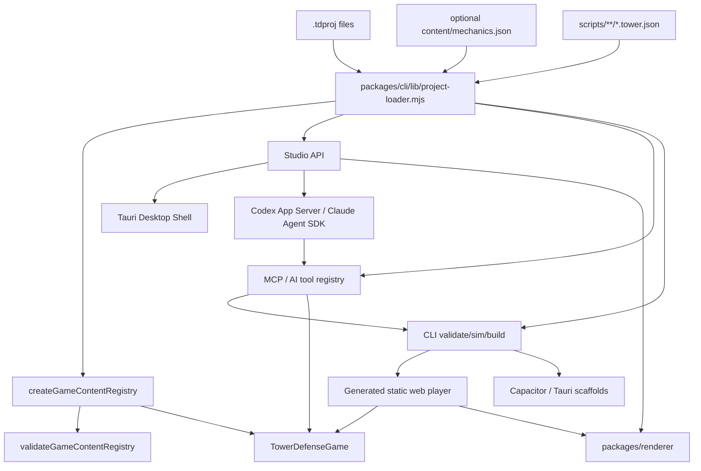

# Architecture

## System Overview

TowerForge has project data, a pure engine core, and adapter layers around it:

```text
.tdproj project data
  -> Node project loader / schema normalization
  -> @towerforge/engine content registry
  -> deterministic headless simulation
  -> CLI, Studio, MCP/AI tools, renderer, generated player, and packaging adapters
```

The engine owns tower-defense rules. The CLI, Studio, and MCP tools own project loading, migrations, filesystem operations, validation UX, source map compilation, asset copying, build output, native scaffolding, and local serving. The renderer owns browser drawing over snapshots and map definitions. The generated web player imports the compiled engine, renderer, and project data.

## Module Boundaries

| Area | Owns | May Depend On | Must Not Depend On |
| --- | --- | --- | --- |
| `packages/engine/src/simulation` | Deterministic gameplay state, tower/enemy mechanics, TowerScript execution, actions, snapshots | `packages/engine/src/content` types, simulation and scripting helpers | DOM, Node, filesystem, Studio, CLI, browser APIs |
| `packages/engine/src/scripting` | Versioned TowerScript types, expression evaluation, validation, and runtime limits | serializable simulation/content types | JavaScript evaluation, DOM, Node, filesystem, network, renderer APIs |
| `packages/engine/src/content` | `GameContentRegistry`, project content validation, runtime content contracts | simulation types and map helpers | Studio UI, CLI filesystem code |
| `packages/cli` | `.tdproj` loading, normalization, engine compilation, validate/sim/build/create commands | compiled engine, Node standard library | Browser DOM, Studio UI state |
| `packages/studio` | Local editor server, browser UI, direct AI adapters, and account-runtime bridge | CLI project loader, shared tool registry, official Codex/Claude runtimes, Node standard library, project files | Direct gameplay rule reimplementation, OAuth credential parsing, arbitrary agent shell/filesystem access |
| `packages/desktop` | Tauri shell, native menus/window lifecycle, packaged Studio runtime, bundled Node/Codex/Claude runtimes, desktop installers | Studio command bridge, Studio server, CLI/MCP/renderer runtime files, Tauri/Rust shell code | Gameplay rules, project schema forks, renderer-specific gameplay behavior |
| `packages/mcp` | Transport-agnostic constructor tool registry plus stdio MCP server | CLI project loader, map compiler, packaging helpers, validation | Gameplay rules outside engine APIs, broad unvalidated filesystem writes |
| `plugins/towerforge` | Canonical Codex plugin source bundle and generated local MCP runtime | Versioned copies of MCP/CLI/engine/renderer runtime files | Cloud backend, credentials, arbitrary workspace discovery, source-only build dependencies |
| `packages/renderer` | Browser Canvas rendering plus pure shared presentation projections consumed by Canvas and Phaser | Browser canvas APIs, serializable snapshots/content data | Gameplay rules, mechanics profiles, engine internals, Node, filesystem, Studio server |
| `packages/player-runtime` | Renderer-neutral browser profile persistence adapter and exact app-scoped storage-key contract | Injected Storage-like port, compiled engine profile codec/content | Browser globals, DOM, Node, gameplay/profile rule duplication, renderer internals |
| `examples/*.tdproj` | Example source projects | documented `.tdproj` schema | Generated build artifacts as source |

## Layering Rules

Allowed dependency direction:

`engine types/helpers -> engine content -> engine simulation -> cli/studio/mcp/player adapters`

Renderer and player runtime are sibling adapters. The renderer consumes serializable snapshots and project visual data; `packages/player-runtime` consumes the engine-owned profile codec through dependency injection and a caller-supplied Storage-like port. Neither adapter owns gameplay/profile rules or imports Node/filesystem code.

Studio, CLI, and MCP MAY share Node project-loader code. Engine MUST remain importable as compiled browser-safe ES modules.

## Data Flow



## Project Format

`.tdproj` is a directory, not a binary file. Source files are stable JSON and should remain git-friendly:

- `project.json`
- `content/balance.json`
- `content/mechanics.json` (optional, versioned opt-in mechanics catalog)
- `content/world-map.json`
- `content/visuals.json`
- `content/story-comics.json`
- `content/battle-backgrounds.json`
- `maps/src/*.tmj`
- `maps/compiled/maps.json`
- `scripts/**/*.tower.json`
- `build-targets.json`

`.towerforge/` is local working state for backups/session files and MUST NOT be committed.

`content/mechanics.json` is deliberately absent from legacy projects and ordinary starter templates. When present, it contains independent versioned module profiles; `mission.mechanics.profiles` selects them per mission. The engine resolves that authored selection into a read-only `CapabilitySet` and is the only authority that may report a module as available. A catalog entry, `enabled: true`, and a valid mission selection are all required before a capability may become active.

Project schema v3 is an explicit mechanics-authoring boundary: a project that authors `content/mechanics.json` MUST declare v3, while v0/v1 migrations and unchanged v2 projects remain v2. Loading, saving, building, packaging, or reading capabilities MUST NOT synthesize the optional file or silently upgrade the manifest.

### Independent version domains

| Domain | Current/first contract | Compatibility rule |
| --- | --- | --- |
| `.tdproj` manifest | v3 when mechanics are authored | Legacy projects without the optional file remain v2 |
| Mechanics catalog and modules | catalog v1; `combat` v1/v2/v3; `reactions`, `navigation`, `physics`, and `terraforming` v1; `elevation` v1/v2/v3 | Reactions depend on the same mission's active combat v2/v3 profile; elevation v2 adds optional LoS, v3 adds optional high-ground rules, and persistent elevation mutation additionally requires the same mission's active terraforming elevation policy; unsupported future versions fail closed and upgrades are explicit |
| Player profile | engine-owned canonical `PlayerProfileV3` codec with explicit v2 migration | Profile migration never follows project migration implicitly; `CampaignRun` remains a separate version domain and browser persistence delegates to the codec |
| Campaign run | engine-owned content-independent `CampaignRunV1` import/export codec | Portable inert run state is explicit-only; no Storage, player, Studio, MCP, snapshot, checkpoint, or capability wiring exists until later opt-in slices |
| Engine checkpoint | `GameCheckpointV1`; `towerforge-sim-v2` | Closed codec and engine/content/RNG/state digests gate atomic restore; active terraforming uses exact inner schema v2 for elevation overrides and timed groups while preserving historic v0/v1 forms, without changing the outer version |
| Command journal | `GameCommandJournalV1` | Closed validation-only codec; journals reference a checkpoint and never live inside checkpoints/projects |
| Deterministic replay | `replayGameCommandJournal`; engine contract in R0C.6 | Validates the complete journal before restore, executes parsed commands once, then checks each normalized result before its post-state digest |
| Multiplayer protocol | versioned contract planned in R8 | Handshake rejects incompatible capabilities/protocols |

These domains MUST evolve independently. A project schema bump MUST NOT rewrite profiles, checkpoints, replays, or network envelopes by implication.

## Cross-Cutting Concerns

- Validation: `validateGameContentRegistry` is canonical for cross-reference and numeric guards.
- Opt-in mechanics: `packages/engine/src/content/mechanics.ts` owns stable module IDs and capability resolution. The loader may structurally normalize catalogs, but Studio, MCP, renderers, and generated players MUST consume the engine result rather than infer availability or gameplay rules.
- Simulation: `TowerDefenseGame` is canonical for gameplay behavior; CLI and Studio must call engine APIs instead of duplicating rules.
- Damage and modifiers: `packages/engine/src/simulation/modifiers.ts` owns the bounded data-only modifier order, and `damage.ts` owns the stateless `DamagePacket`/`DamageResolver` pipeline. `TowerDefenseGame.resolveAndApplyDamage` is the single private resolver/HP-mutation boundary for tower hits, abilities, TowerScript, status/DoT, enemy attacks, and core leaks; before resolution or mutation it fails closed unless the packet target kind and exact enemy/tower id and type match the mutable target. Packet wrappers, events, death, and rewards remain in the game runtime. A leaked enemy's `hp = 0` is a removal marker, not a damage bypass. R1.1 preserves every public schema and legacy result. See [ADR 0017](docs/adr/0017-damage-routing-equivalence.md).
- Combat shields: `combat` v1 is a closed opt-in shield catalog for enemy types and destructible tower types. The engine applies an active runtime shield after resolution/resistance and before HP, owns regeneration and typed change events, and serializes state through snapshots/checkpoints. TowerScript v3 can observe and restore existing shields but cannot create them. See [ADR 0018](docs/adr/0018-opt-in-combat-shields.md).
- Combat armor and marks: `combat` v2 retains shields and adds author-defined `damageTypes`, `armorTypes`, and enemy-only `armorAssignments`; v3 adds enemy-only mark definitions and source bindings. Primary damage uses `source modifiers -> marks -> armor matrix -> entity resistance -> legacy pierce_only -> shield -> HP`. Armor remains stateless; live mark stacks/duration use combat-state schema v2 and deterministic checkpoint/replay. `armor_piercing` bypasses only the legacy adapter. See [ADR 0019](docs/adr/0019-opt-in-armor-matrix.md) and [ADR 0020](docs/adr/0020-opt-in-vulnerability-marks.md).
- Elemental reactions: the independent `reactions` v1 module owns bounded exposures, directional AND-predicate rules, consumption, and secondary damage plans. It requires an active combat v2/v3 profile for each selected mission. Eligible direct enemy hits complete the primary pipeline first; reaction damage then re-enters the same resolver and death/reward settlement remains exactly once. Synchronous FIFO execution is capped at depth 4 and 256 secondary packets per root. Exposure state uses optional top-level reactions-state schema v1; pending work is never checkpointed. See [ADR 0021](docs/adr/0021-opt-in-elemental-reactions.md).
- Authored elevation: R3.1 adds sparse signed `GridMapDefinition.elevationOverrides` with implicit zero and a closed empty `elevation` v1 mission profile. R3.2 extends the module monotonically to v2 with optional deterministic LoS, and R3.3 extends it to v3 with an independent bounded `highGround` sibling; topology, acquisition, LoS, and damage rules stay in the engine. Authored values remain the immutable base. Accepted R3.4b C3A may layer sparse persistent runtime values over that base only when both the mission's elevation profile and the terraforming profile's elevation policy are active. Accepted C3B may temporarily replace that effective value while retaining the exact persistent/authored before-image. `GridMap.elevationAt`, `snapshot.elevation`, LoS, and high-ground read the effective value; reset removes the runtime layer. The active inner checkpoint section preserves runtime elevation and any timed ownership, while inactive/disabled/unselected projects retain the earlier byte shape. See [ADR 0023](docs/adr/0023-opt-in-authored-elevation-foundation.md), [ADR 0024](docs/adr/0024-opt-in-deterministic-elevation-line-of-sight.md), [ADR 0025](docs/adr/0025-opt-in-authored-high-ground-modifiers.md), and [ADR 0027](docs/adr/0027-opt-in-transactional-terraforming.md).
- Tile displacement physics: R3.4a is a separate opt-in `physics` v1 capability. Pipeline tower and custom ability effects can request bounded whole-tile push/pull; engine topology chooses the first stable strict-distance neighbor before route/field classification, authored routes stay on-track, and dynamic navigation reuses the existing cached field without sliding or rebuilding it. Closed own-data effect inspection and active-only 8-effect/64-target/4,096-step activation plus 32,768-step tick budgets bound defensive runtime work. Explicit terrain tags define terminal fall hazards, which use the normal exactly-once death lifecycle rather than `DamagePacket`. Budget counters and forces are not persistent snapshot/checkpoint state. Canvas and Phaser consume detached engine events through a shared fail-closed projector. R3.4b owns terrain/elevation mutation and reachability rollback separately. See [ADR 0026](docs/adr/0026-opt-in-tile-displacement-physics.md).
- Transactional terraforming: R3.4b is the accepted separate opt-in `terraforming` v1 capability rather than an extension of physics. Its closed engine profile describes authored terrain-tag transitions and an optional elevation policy; mission-scoped validation distinguishes active errors from inactive warnings and never borrows transition IDs from another profile. TowerScript v6 adds the closed `terraformTiles` batch contract and `elevationChanged` event, while descriptor-safe validation rejects accessors, proxies, sparse arrays, and over-budget inputs without executing them. Runtime C1 stages persistent terrain batches on `authored_routes`; C2A builds detached baseline/candidate dynamic resolvers and atomically adopts verified state; C2B1/B2A/B2B close the canonical spawn/obligation proof under hard ceilings of `16 384` safety sources/causes, `256` fields, and `8 388 608` baseline+candidate field/proof cells. C3A adds persistent elevation and mixed atomic batches; C3B adds deterministic bounded timed ownership, grouped expiry, snapshot state, and exact inner checkpoint schema v2 with historic v0/v1 compatibility. C4A routes active legacy TowerScript terrain actions through the same candidate→proof→publish tail, and C4B does the same for the full immutable-base `path_water` selection. Absent, disabled, and unselected square/hex missions retain their literal legacy branches. C5A exposes engine descriptors, project-bound inert recipes, guarded CLI/MCP/AI mechanics authoring, and separate script upsert; C5B adds the detached, revision-guarded Terraforming card without changing ordinary forms or Visual Graph. C6 adds one bounded, descriptor-safe `projectTerraformingPresentation`: effective tile/elevation snapshots are authoritative, current events are invalidation hints only, and pending expiry groups are validation-only. Canvas and Phaser share square self+8 / odd-r self+6 autotile expansion and use full redraw if bounded union/expansion fails, so a snapshot diff is never lost. The same modules ship in Studio Playtest, generated PWA/single-file players, web packages, and `.tdpack`; the public opt-in fixture is `docs/examples/opt-in-transactional-terraforming/`. Outer checkpoint v1, engine v2, public TowerScript v6, project v3, mechanics catalog v1, snapshot, command, journal, replay, MCP protocol, renderer, and player versions remain unchanged; only the additive agent guide is v15. See accepted [ADR 0027](docs/adr/0027-opt-in-transactional-terraforming.md).
- Rogue-lite synergies: R4.1A adds closed opt-in `roguelite` v1 profiles and optional tower-type `tags`. The pure engine counts live placed instances, derives the greatest reached tier by default or all reached tiers in explicit cumulative mode, and compiles only damage modifiers at stage `run`. The derived optional `snapshot.roguelite` is rebuilt from tower state rather than stored as a second checkpoint authority. Studio and MCP share the engine descriptor and one revision-guarded three-file transaction for manifest, catalog, and tower tags; the inert `basic_elemental_synergy` recipe never enables or selects the module. Canvas and Phaser use the shared fail-closed projector and never evaluate counts or tiers. Legacy projects have no roguelite snapshot, visible status panel, navigation, or runtime effect; the shared hidden status mount remains inert. Artifacts, draft, campaign reducers, TowerScript, and new commands remain outside this slice. See [ADR 0030](docs/adr/0030-opt-in-roguelite-tower-synergies.md).
- Combat presentation: `packages/renderer/src/combat-presentation.mjs` projects only optional snapshot state/events into bounded, fail-closed shield, mark, exposure, and reaction views/cues. Canvas, Phaser, Studio playtest, generated PWA, and single-file players share that projection; renderers never read mechanics profiles or calculate combat outcomes. An absent combat/reactions snapshot adds no mechanic-specific draw work. Terminal change events may use safely projected previous/spawn coordinates after state leaves the snapshot, while explicitly present future schemas are rejected.
- Deterministic RNG: `packages/engine/src/simulation/rng.ts` owns the browser-safe `xoshiro128**` implementation, typed seed expansion v1, unbiased integer sampling, and versioned serializable state. Its golden vectors are compatibility contracts. R0C.1 does not inject RNG into `TowerDefenseGame`; future consumers must receive/use this engine instance rather than host randomness.
- Versioned commands: `packages/engine/src/simulation/commands.ts` owns `GameCommandV1` and the only validated dispatcher for deterministic gameplay mutations. It canonicalizes untrusted own data descriptors into detached values, bounds JSON signal payloads by depth, node count, and UTF-8 bytes, and rejects transport envelope fields. The legacy headless `SimulationAction` is an adapter; player/Studio migration to the dispatcher is a later R0C surface slice.
- Stable digests: `packages/engine/src/simulation/stable-digest.ts` owns strict canonical JSON serialization, the versioned FNV-1a 64 state digest, and the simulation-content fingerprint used to gate future checkpoint/replay restore. Content projection is schema-aware: it removes presentation metadata only at known definition boundaries, preserves arbitrary gameplay record IDs (including `color`, `label`, and `__proto__`), never invokes excluded getters or `mapFactory`, and does not cache mutable registry identities.
- Checkpoints: `packages/engine/src/simulation/checkpoint.ts` owns the browser-safe `GameCheckpointV1` envelope, independent checkpoint/engine version headers, strict data-descriptor helpers, and full-envelope digest. `TowerDefenseGame` alone inventories and restores authoritative mutable state. Restore validates the complete closed state before constructing a map, skips `gameStarted`, then rebuilds terrain overrides, optional elevation overrides, exact timed-expiry ownership, occupancy, and temporary-water cues. The C3B inner terraforming schema v2 does not change outer checkpoint v1 or engine v2 and participates in the ordinary state digest; historic inner v0/v1 form and digest remain stable until successful timed promotion. `GameSnapshot` is not a checkpoint codec; command journals and multiplayer envelopes are separate contracts.
- Command journal: `packages/engine/src/simulation/journal.ts` owns `GameCommandJournalV1`, `JournaledGameSession`, result normalization, capacity limits, detached export, and validation-only decode. `command-internal.ts` is the single non-public strict parse/execute path shared by the journal and `dispatchGameCommand`. Journal decode validates the embedded checkpoint without creating a map and never executes commands; deterministic execution remains a separate consumer.
- Deterministic replay: `packages/engine/src/simulation/replay.ts` owns the pure `replayGameCommandJournal` API and typed first-divergence diagnostics. It fully validates and parses a detached journal before map restore, restores exactly one fresh game from the initial checkpoint, executes each parsed command exactly once, compares its normalized durable result before its post-state digest, and stops at the earliest mismatch. Replay state is not persisted in projects, checkpoints, snapshots, profiles, Studio, MCP, players, or multiplayer envelopes.
- Player profiles: `packages/engine/src/profile/player-profile.ts` owns profile schema, bounded migrations, canonical serialization, launch options, validation, and immutable reducers. `packages/player-runtime` owns only fail-closed persistence through injected codec/content/storage dependencies: load is read-only, save validates before one preflight read and protects future versions, and normal reset removes only the exact profile key. Canvas and Phaser consume one shared generated profile fragment; emergency boot recovery additionally clears only the current app's story namespace. See [ADR 0016](docs/adr/0016-player-profile-runtime-and-persistence.md).
- Build: `packages/cli/build.mjs` validates the project, compiles engine runtime, and emits an offline static web bundle with engine, renderer, and player runtime plus an optional `file://`-runnable `index.single.html`. The service worker precaches the runtime and single-file rewriting leaves no unresolved runtime import.
- Game packaging: `packages/cli/package.mjs` emits a deterministic portable web ZIP with a loopback launcher, or wraps the web bundle into Capacitor mobile / Tauri desktop scaffolds. It does not sign, upload, or publish.
- Studio desktop packaging: `packages/desktop` builds installable TowerForge Studio apps with Tauri v2 and bundled Node, Codex, and Claude Code runtimes. The packaged runtime mirrors CLI, prebuilt engine, renderer, and player runtime and MUST NOT require user-installed Node, npm, TypeScript, Codex, or Claude Code after installation.
- Desktop commands: Rust owns native menu/window/project-switch lifecycle; Studio owns the shared command registry, unsaved-change UX, and editor actions. The external loopback WebView receives only a narrow Tauri event/invoke capability and never gets raw filesystem or shell access.
- Localization: `packages/studio/public/i18n.js` owns Studio shell translations and persists `towerforge:language` in browser-local settings. Russian is the default locale and English is the canonical fallback. The locale is included in desktop UI-state sync so Tauri rebuilds native menus without changing command IDs. Project-authored labels, IDs, scripts, and generated-game content remain data and MUST NOT be rewritten by UI localization.
- Maps: every runtime map owns a grid definition: `{kind:"hex",layout:"odd-r"}` or `{kind:"square",adjacency:"cardinal"}`. `packages/cli/lib/map-compiler.mjs` compiles `maps/src/*.tmj`, validates bounds, typed walkability, topology-specific route adjacency, and optional sparse elevation, then writes `maps/compiled/maps.json`. Coordinates remain `{q,r}` for both grids. Authored `elevationOverrides` require project v3, default to `0`, drop explicit zeroes, and compile in numeric `(r,q)` order without changing legacy sources.
- Migrations: `packages/cli/lib/project-migrations.mjs` applies schema migrations in memory; `npm run migrate -- --write` persists them with backups.
- Writes: Studio uses hash-guarded atomic writes and backs up changed files under `.towerforge/`.
- Assets: `content/visuals.json` is the visual/audio/tile catalog. It supports standalone and atlas-frame sprites, weighted deterministic tile variants, Wang edge/corner/mixed/blob rules, square four-sector and hex six-sector composition, event SFX, looping music, and a validated UI/renderer theme palette. Tileset bindings resolve map -> grid -> legacy tile sprite -> color fallback. Bundled packs live under `packages/cli/theme-packs`; `packages/cli/lib/theme-packs.mjs` owns preview, confined asset copy, revision guards, backups, post-write validation, and rollback. Asset paths are project-relative only; build copies safe referenced files into `dist`.
- Gameplay composition: new towers should prefer the `pipeline` attack model: deterministic targeting selects primary enemies, delivery expands the target set (`single`, `multi`, `area`, `chain`, or `aura`), and ordered effects apply damage, status, or resource changes. Legacy attack kinds remain supported for project compatibility.
- Custom gameplay: `scripts/**/*.tower.json` defines deterministic TowerScripts bound to global, mission, map, wave, tower, enemy, ability, or terrain scopes. TowerScript v2 adds `enemyEnteredTile`/`terrainChanged` and budgeted `setTileTerrain`/`restoreTileTerrain`; v1 remains readable. `TowerDefenseGame` owns event dispatch, expressions, per-binding state, actions, signals, diagnostics, and budgets. Scripts receive JSON context only and never execute host JavaScript or access filesystem, network, DOM, clock, randomness, or modules.
- Project tree: Studio exposes a filtered, non-sensitive `.tdproj` tree for orientation. Generic writes are confined to `scripts/`; content, maps, and assets remain owned by their validation-aware editors. Script writes use revision guards, atomic replacement, backups, full validation, and rollback.
- Difficulty and progression: `content/balance.json` may declare difficulty multipliers plus persistent meta currencies, upgrades, and per-mission rewards. The engine owns canonical `PlayerProfileV3`, the explicit v2→v3 migration, immutable rules/codecs, and launch options; it never reads browser storage. V3 deliberately retains the same five persistent fields and does not absorb run state. Both generated players use those reducers through the renderer-neutral, app-scoped persistence adapter.
- Narrative: `content/story-comics.json` and `content/battle-backgrounds.json` are validated project data emitted into both generated players. Panels reference catalog sprite IDs; backgrounds reference missions and optional standalone sprites.
- MCP and AI: `packages/mcp/tools.mjs` is the shared tool contract for the external MCP server and Studio AI Chat. Connections, API keys, and provider defaults live in Settings; the working conversation is a right-side dock. Direct API-key adapters target Anthropic Messages, OpenAI Responses, and OpenRouter Chat Completions. Account adapters use Codex App Server with ChatGPT OAuth and Claude Agent SDK with Claude Code account auth. The account bridge exposes only an allowlist of validated TowerForge tools; it does not expose package/build tools, raw filesystem APIs, or a shell.
- Codex plugin: `.agents/plugins/marketplace.json` and `plugins/towerforge` are the canonical development source. `npm run plugin:build` creates the runtime from canonical MCP/CLI/engine/renderer/player-runtime packages plus required production dependencies. A deterministic exporter publishes only the marketplace bundle, license, release metadata, and distribution docs to `Lindforge-Studios/towerforge-codex-plugin`; that mirror is never an independent source tree. Installed mode requires Node 22, never runs npm, and uses `TOWERFORGE_MCP_WORKSPACE_BOUND=1`. It discovers `.tdproj` directories only below client-provided MCP filesystem roots, rejects model-supplied `projectDir`, and redacts local paths from results. Direct `--project` MCP mode remains available for other clients.
- Agent-runtime privacy: OAuth storage and refresh belong exclusively to the official runtime. Codex uses managed auth plus OS keyring storage; Claude uses its dedicated config directory. TowerForge does not read, return, log, or persist OAuth/access/refresh tokens. Runtime work happens from an isolated empty directory and private runtime `HOME`; Codex turns restrict filesystem reads to that workspace plus platform defaults, Claude built-in tools are disabled, local transcript persistence is disabled, child environments omit API keys, cloud credentials, proxy credentials, and debug/telemetry variables, and the Studio page CSP permits network connections only to its own loopback origin. Image input is decoded only after MIME/signature/size validation. Codex receives generated temporary filenames under the isolated workspace and deletes them after the turn; Claude and direct APIs receive validated base64 image data. Videos are decoded in the WebView and represented by at most four still frames, without the original filename, original file, or audio.
- Observability: Studio save/sim/build/map compile/asset import actions write JSONL traces under `.towerforge/runs/`. CLI/MCP simulation reports include aggregate event counts, event timeline, resource timeline, milestone snapshots, strategy inputs, and next valid actions.

## Agent Tool Contract

Agent-facing tools are application contracts, not raw filesystem access.

- Read/compute tools such as domain-scoped `describe_schema`, `get_project_summary`, `get_progression`, compact `list_entities` / `get_entity`, script/tree reads, validation, simulation, theme discovery, and balance reports MUST be safe to run without mutating project source files.
- Mechanics discovery MUST use `describe_schema` plus `get_capabilities`. Preview/apply MUST reject engine-unavailable, unsupported, or dependency-incompatible module versions before any write; enable and upgrade operations MUST update the manifest, catalog, and mission selection as one revision-guarded, validated, backed-up transaction with rollback. Combat v2/v3 MUST NOT be silently downgraded, and reaction recipes MUST NOT patch combat or terrain prerequisites.
- Elevation map authoring MUST use the granular `preview_map_elevations` / `apply_map_elevations` transaction. Its revision covers `project.json`, the compiled map aggregate, and every `maps/src/*.tmj`, so a concurrent edit to any source cannot publish stale compiled data. The transaction writes only the confined target source, compiled data, and manifest; it performs the explicit project-v3 upgrade, validates, backs up, and rolls back its owned files while preserving conflicting external edits. The `basic_authored_elevation` mechanics recipe returns only `{}` and MUST NOT mutate a map or enable/select the module.
- Line-of-sight authoring MUST use elevation module v2 and the existing guarded mechanics transaction. `analyze_line_of_sight` is compute-only, requires the current composite mechanics revision, and may analyze either active content or the exact preview candidate. It MUST NOT mutate or synthesize terrain, map elevation, mechanics, snapshots, or project versions. The `basic_elevation_line_of_sight` recipe only proposes a profile and reports a missing `opaque` prerequisite.
- Local write tools such as `compile_maps`, `apply_validated_patch`, granular entity CRUD, `import_asset`, tileset import/binding, `bind_sprite`, `bind_mission_music`, narrative/background writes, build, and package tools MUST validate inputs, scope writes under the active project, and return structured results.
- Balance and visual writes MUST create `.towerforge/mcp-backups` backups and roll back when post-write validation fails.
- `upsert_tower_script` MUST support dry-run, script-catalog revision checks, confined atomic writes, full project validation, backup, and rollback.
- Progression MUST preserve a `get_progression` -> `dry_run_progression_patch` -> `apply_progression_patch` flow, validate complete difficulty/meta candidates, guard the balance revision, and roll back invalid writes.
- Studio, account runtimes, and external MCP clients MUST share `packages/mcp/agent-instructions.mjs`; engine-owned schema descriptors are the source of truth for advertised combat, progression, and TowerScript capabilities. The combat descriptor exposes the closed `ModifierSpec`, `DamagePacket`, shield, armor-matrix, and mark vocabulary and bounds instead of duplicating those allowlists in MCP or Studio.
- Studio AI Chat MUST reuse the MCP `callTool` surface with `projectDir` forced to the server's active project instead of letting the model choose arbitrary project roots.
- The Codex marketplace plugin MUST fail closed until the client shares filesystem roots. Project discovery MUST be bounded, skip symlinks and generated/dependency directories, and expose only opaque project ids plus workspace-relative labels. Tool schemas in this mode MUST omit `projectDir`.
- Studio AI provider keys MUST remain browser-local, be sent only to the loopback server for the active request, and never be written to project files or traces.
- Account runtimes MUST own their OAuth lifecycle. Studio may expose only safe account status, a provider-validated HTTPS authorization URL, and connect/logout actions; it MUST NOT inspect runtime credential files or accept tokens from the WebView.
- Codex and Claude account turns MUST run from the isolated agent-runtime directory with project access only through the TowerForge tool allowlist. Unsupported runtime requests and tool names fail closed.
- AI prompts and tool results necessarily leave the machine for the selected provider. The UI MUST state this clearly and must not imply that OAuth isolation makes model inference offline.
- AI model catalogs and reasoning choices MUST come from the official account runtime when available. A selected image-capable model receives only attachments explicitly selected for the current turn.

## Invariants

- MUST keep `packages/engine` browser-safe and Node-free.
- MUST keep `packages/player-runtime` renderer-neutral, free of browser-global/DOM/Node imports, and dependent on injected storage plus the engine-owned profile codec rather than duplicated profile rules.
- MUST validate a project before build.
- MUST normalize legacy project fields in the Node loader, not inside the engine.
- MUST preserve the no-file invariant: absent `content/mechanics.json` means no mechanics capability is active and legacy runtime/UI/build behavior is unchanged.
- MUST preserve the no-elevation-field invariant: opening, loading, validating, saving, building, or packaging a legacy project MUST NOT synthesize `elevationOverrides`, an elevation module, or a project-v3 upgrade.
- MUST treat engine availability separately from authored catalog state; project data cannot claim an unimplemented capability.
- MUST route every HP/core damage source through `DamageResolver`; adapters may construct packets and contexts, but MUST NOT reproduce resistance, legacy armor, or modifier ordering outside the engine pipeline.
- MUST NOT call `Math.random()` in production engine code. Gameplay randomness must use the versioned `SeededRng` contract and persist its state wherever replay/checkpoint semantics require it.
- MUST keep `GameCommand` free of timestamps, player ownership, network sequence, and transport metadata. Those belong to the independently versioned multiplayer envelope, not deterministic simulation input.
- MUST version project, mechanics modules, player profiles, checkpoints/replays, and multiplayer protocol independently.
- MUST keep generated output under a project output directory such as `dist`.
- MUST NOT hardcode any specific game's content ids or local paths into runtime code (see the content-id-agnostic invariant).
- MUST keep asset imports project-relative and reject absolute paths, external URLs, and `..` traversal.
- MUST NOT execute project-authored JavaScript or expose host capabilities to TowerScript. New scripting capabilities enter through typed engine events/actions and deterministic tests.

## Renderers

The build emits one of two web players per build target (`build-targets.json` → `target.renderer`):

- `canvas` (default) — the zero-dependency shared canvas renderer contract.
- `phaser` — a Phaser 3 scene player. Phaser is vendored at `packages/renderer/vendor/phaser.min.js` and copied to `dist/vendor/`, so the offline PWA still works (no CDN). Both players share the engine, project data, and HUD.

Every template/grid/renderer combination is a release contract. `template-renderer-conformance.test.mjs` builds Classic, Maze, Idle, and Roguelike on hex and square grids through Canvas and Phaser: 16 outputs. The Playwright matrix verifies browser boot, difficulty/meta UI, exact pointer picking, tile visuals, and keyboard placement.

## Maps

`maps/src/*.tmj` are Tiled-style sources. The compiler (`packages/cli/lib/map-compiler.mjs`) reads the `terrain` tile layer (`layers[].data`, GID↔terrain) as the authoritative terrain grid and merges explicit `terrainOverrides` on top. Orthogonal sources compile to square/cardinal maps; hexagonal sources compile to hex/odd-r maps. Routes connect only through authored neighboring `pathRoutes` segments. Terrain semantics come from `balance.terrainTypes`: `buildable`, `walkable`, `groundSpeedMultiplier`, and `tags`.

Project-v3 map sources may additionally carry a top-level `elevationOverrides` array or its JSON representation in a Tiled property. Values are sparse closed `{q,r,elevation}` safe-integer rows, bounded to 65,536 entries and `-1_000_000..1_000_000`; coordinates are unique and in bounds. Missing cells have elevation `0`, explicit zero rows compile away, and nonzero output is canonical numeric `(r,q)`. R3.1 establishes these values as the immutable authored base; R3.2/R3.3 may consult the effective elevation only through an enabled, selected elevation profile. Accepted R3.4b C3A can add an engine-owned persistent runtime layer only under a simultaneously active terraforming elevation policy, and C3B can temporarily replace an effective value while retaining its exact before-image. C4A reuses that native timed state for active legacy TowerScript terrain sets and common route proof for active legacy sets/restores; C4B uses it for the full immutable authored-path selection of active `path_water`. Neither compatibility adapter changes source-map authoring nor activates the module implicitly. Snapshot elevation schema v1 exposes the resulting sparse effective layer; active terraforming snapshot schema v1 exposes only pending group expiry state, while inner checkpoint schema v2 records runtime differences and timed ownership. Outer checkpoint, command, and journal version domains do not change, and inactive/disabled/unselected paths retain the earlier shape.

`content/visuals.json` schema v2 stores tile atlases, materials, connection groups, signatures, weighted transforms, and map/grid bindings. `packages/renderer/src/autotile.mjs` is shared by Canvas and Phaser. Variant choice hashes map id, coordinate, tileset, terrain, signature, and seed. Runtime terrain changes invalidate only the affected cell and its signature-dependent neighbors. Incomplete reachable coverage is allowed while authoring, but `build` and `release_readiness` fail until every observed signature resolves.

Studio's Tileset Workbench imports PNG spritesheets plus TSJ/TSX Wang metadata, previews slicing and coverage, and permits guarded material/terrain mapping edits. XML DTD/entities, external images, path traversal, symlink escapes, invalid PNG signatures/dimensions, and oversized input are rejected. Preview and commit use revision checks; commit backs up and rolls back the PNG and catalogs together.

## Current Limitations

- Canvas, Studio Playtest, and Phaser share grid geometry and autotile resolution. Verdant Frontier and Frostbound Citadel ship complete square edge-16 and hex edge-64 battlefield sheets; richer unit/tower sprite families and batch binding remain open.
- The Phaser player is shipped as an offline vendored build target and has tile atlas/transform/sector parity with Canvas. Tower/enemy sprite parity and repeatable swarm-scale performance budgets remain open.
- Capacitor mobile and Tauri desktop scaffold export are shipped. Store signing, store submission, cloud publishing, and upload automation are not implemented.
- TowerForge Studio desktop packaging is implemented as a Tauri shell around the existing Studio server. Production macOS notarization and Windows code signing require external signing credentials.
- TowerScript v1/v2 is a structured JSON language rather than arbitrary JavaScript/Lua. It has no breakpoints or language server, and mechanics outside its current action library require a typed engine action/event extension.
- Account-runtime integrations depend on pinned official Codex/Claude protocols. Codex dynamic tools are currently an experimental App Server field; protocol drift must fail closed and be covered by adapter tests before dependency upgrades.
